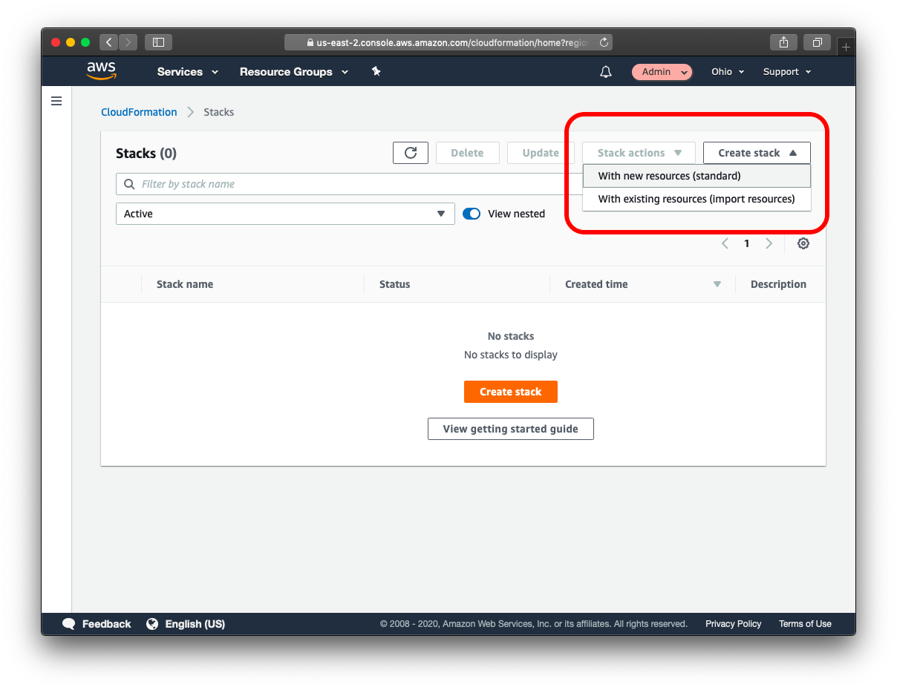

# Data durability and recovery

In this project a highly available solution to build a Multi-Availability Zone, Multi-Region database is described.
Additionally it is demonstrated how to use it in multiple geographically separate AWS regions.

AWS CloudFormation will be used to create Virtual Private Clouds(VPC), as well as additionally instances and RDS database.
CloudFormation is an AWS service that allows you to create "infrastructure as code". This allows you to define the infrastructure you'd like to create in code, just like you do with software. This has the benefits of being able to share your infrastructure in a common language, use source code control systems to version your infrastructure and allows for documenting and reviewing of infrastructure and infrastructure proposed changes.

CloudFormation allows you to use a configuration file written in a YAML file to automate the creation of AWS resources such as VPCs. In this project, you will use a pre-made CloudFormation template to get you started. This will allow you to create some of the infrastructure that you'll need without spending a lot of time learning details that are beyond the scope of this course.

## Getting Started

In order to build a VPC from the CloudFormation Stack file, follow the steps:

1. Services -> CloudFormation
2. Create stack “With new resources (standard)”
  
3. Template is ready
4. Upload a template file
5. Click “Choose file” button
6. Select provided YAML file
7. Next
8. Fill in Stack name
9. Name the VPC
10. Update the CIDR blocks
11. Click Next
12. Click Next again
13. Click Create stack
14. Wait for the stack to build out.  Refresh until status becomes “CREATE_COMPLETE”
15. Observe the “Outputs” tab for the created IDs.  These will be used later.

Once the CloudFormation Stack has completed, you can look at the "Resources" tab to see all of the AWS resources that the stack has created.  You can see both the type of resources that have been created, as well as the AWS identifiers for those resources so that you can locate these resources in the AWS service that they are a part of.

The "Outputs" tab shows you custom output from the CloudFormation Stack that is labeled and described for you.
These descriptions are the custom descriptions that were added to the CloudFormation template
and make it easier for you to find specific values that have been created as a part of the CloudFormation stack.  
Here, you can find the VPC ID that has been created, the subnet IDs including which subnets are public and which are private,
and the Security Groups that have been created and a description of each.

### Data durability and recovery
In order to achieve the highest levels of durability and availability in AWS you must take advantage of multiple AWS regions.
1. Pick two AWS regions. An active region and a standby region.
2. Use CloudFormation to create one VPC in each region. Name the VPC in the active region "Primary" and name the VPC in the standby region "Secondary".

**NOTE**: Be sure to use different CIDR address ranges for the VPCs.

VPC setup should look like the following:

### Highly durable RDS Database
1. Create a new RDS Subnet group in the active and standby region.
2. Create a new MySQL, multi-AZ database in the active region. The database must:
     - Be a “burstable” instance class.
     - Have only the “UDARR-Database” security group.
     - Have an initial database called “testdb”
3. Create a read replica database in the standby region. This database has the same requirements as the database in the active region.

# Estimation of availability of this configuration

### Availability Estimate

RDS takes daily snapshots of the database as well as transactional logs (up to 5 minutes intervals).
With this in mind, RTO in a Single AZ deployment may vary from from minutes to hours. However using transaction logs - RPO can be minimized up to 5 minutes.

In the event of a failure in the Single AZ deployment, RDS automatically attempts to launch a new instance in the same Availability Zone, attach the EBS volume,
and perform recovery.
In this scenario, RTO is typically under 30 minutes, RPO - is zero because the data from EBS volume has been restored.

The RDS Multi-AZ configuration is the recommended approach for production environments due to its ability to support low RTO (recovery time objective) and RPO (recovery point objective) requirements.
RTO in such case may be less than 10 minutes. In case of Availability Zone failure, the DNS endpoint will be switched from failed Primary to a Standby instance.
RPO will be the number of lost queries within timeframe between RDS detecting that AZ is down and switching DNS endpoint.
If retry is implemented on the application side, PRO is negligible as no queries will be lost and application just keeps retrying until query is succeeded.

## Minimum RTO for a single AZ outage

AZ failures are rare, RTO is under 30 minutes. At the minimum it takes around 5 minutes to promote standby instance to a master. 

## Minimum RTO for a single region outage

Time of Read Replica in healthy region being promoted to a standalone DB cluster after detecting primary region outage. % minutes or less.

## Minimum RPO for a single AZ outage

0 minutes, as volume is recovered from standby instance.

## Minimum RPO for a single region outage

Up to 5 minutes as Read Replicas is updated asynchronously and should contain most of the transaction logs from primary.

## Optional steps

### Checking normal usage
In the active region:
1. Create an EC2 keypair in the region
2. Launch an Amazon Linux EC2 instance in the active region. Configure the instance to use the VPC's public subnet and security group ("UDARR-Application").
3. SSH to the instance and connect to the "udacity" database in the RDS instance.
4. Verify that you can create a table, insert data, and read data from the database.
5. You have now demonstrated that you can read and write to the primary database

**NOTE**: The above described steps can be automated by launching instance using CloudFormation stack described in [CF stack](./cloudformation/ec2.yaml)

### Monitoring database
1. Observe the “DB Connections” to the database and how this metric changes as you connect to the database
2. Observe the “Replication” configuration with your multi-region read replica.

### Failover And Recovery
In the standby region:

1. Create an EC2 keypair in the region
2. Launch an Amazon Linux EC2 instance in the standby region. Configure the instance to use the VPC's public subnet and security group ("Application-SG").
3. SSH to the instance and connect to the read replica database.
4. Verify if you are not able to insert data into the database but are able to read from the database.
5. You have now demonstrated that you can only read from the read replica database.
6. Promote the read replica
7. Verify that if you are able to insert data into and read from the read replica database.
8. You have now demonstrated that you can read and write the promoted database in the standby region.

**NOTE**: The launching of RDS instance with Read Replica instance in the same region can be automated by launching instance using CloudFormation stack described in [CF stack](./cloudformation/rds.yaml)
